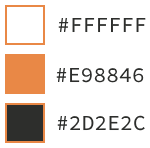

# xtermjs-branding

## Logo/avatar

## Full logo

 
 

## Palette

## Font

The font used in the SVG is "Source Code Pro", if the font is not present then it will revert to some other font. In general the .png files should be used.
